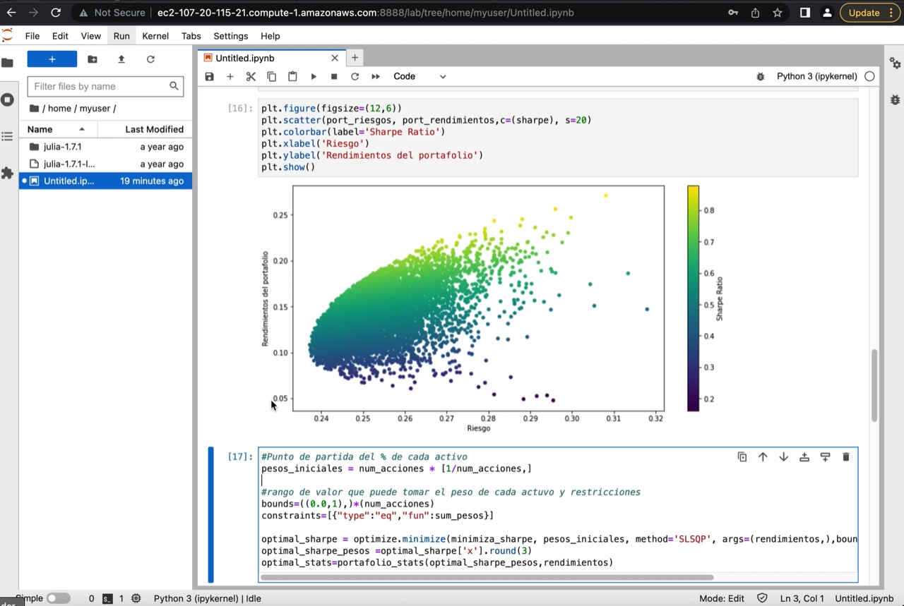

# Equipo 4

## Distribución de roles por usuario

| github user  | Integrante                |Tarea | Rol             |
|--------------|---------------------------|------|-----------------|
| leonfgz48    |Leon Felipe Gomez Zarza    |  1   | Programación    |
| afuentesc    |Alberto Fuentes Chavarria  |  1   | Programación    |
| RGGA90       |Ricardo Guillermo Granillo Alatorre |  2   | Revisión        |
| esesancr     |Sergio Sánchez Reyes       |  3   | Project Manager |

## Título del proyecto
**Optimización de Portafolio**

## Objetivo del proyecto 
Existen muchas formas de crecer el patromonio de un inversionista. Una de las formas más comunes que existen es el de invertir en el mercado financiero en acciones que cotizen dentro de las Bolsas de valores. La pregunta natural que nace apartir de lo anterior es ¿Qué empresas deberá seleccionar el inversionista para que su dinero este relamente bien invertido?. En este punto deberemos saber que existe una compensación entre el riesgo y el rendimiento, es decir, para aumentar el rendimiento esperado de la inversión, entonces el inversor debe estar dispuesto a tolerar mayores riesgos, por lo que en este proyecto buscaremos  maximizar la ganancia asociada a ciertos niveles de riesgo. 

## Problema de optimización 
Método: Sequential least squares.

EL método sequential least squares es un método iterativo para problemas no lineales de optimización restringidas. 
El problema parte de que la función puede ser aproximada como: $f(x)\approx f(x)+\nabla f(x^k)(x-x^k)+\frac{1}{2} (x-x^k)Hf(x^k)(x-x^k)$, con H como la Hessiana.

Sujeto a las funciones g y h por sus aproximaciones afines locales: 

$g(x)\approx g(x^k)+\nabla g(x^k)(x-x^k)$

$h(x)\approx h(x^k)+\nabla h(x^k)(x-x^k)$

Si el problema solo tiene restricciones de igualdad, entonces el método es equivalente a aplicar el método de Newton a las condiciones de optimalidad de primer orden, o condiciones de Karush-Kuhn-Tucker, del problema.

## Ligas de interés
- [Liga a repo de trabajo](https://github.com/esesancr/proyecto_final_equipo_4)

- [Liga a trabajo escrito](https://github.com/esesancr/proyecto_final_equipo_4/blob/main/Euipo4_Final_Opti%202022.ipynb)

- [Liga a presentación final](https://github.com/esesancr/proyecto_final_equipo_4/blob/main/Optimizaci%C3%B3n%20de%20Portafolio.pdf) 

En la carpeta [avance1](avance1) se encuentra la definición del objetivo y el planteamiento del problema. 

En la carpeta [avance2](avance2) se encuentra el reporte del segundo avance en nuestro proyecto. 

## Evidencia de uso de AWS

### Adquisición de los Rendimientos con granularidad diaria.

### Simulación de Portafolios.

### Optimización de Portafolio.

## Referencias del proyecto:

- Paul Wilmott On Quantitative Finance
- Springer Series in Operations Research and Financial Engineering
- H.M.MARKOWITZ,Portfolioselection,JournalofFinance
- https://plotly.com/python/v3/ipython-notebooks/markowitz-portfolio-optimization/
- https://www.youtube.com/watch?v=p5pL8ZSeoN4
- https://en.wikipedia.org/wiki/Sequential_quadratic_programming
